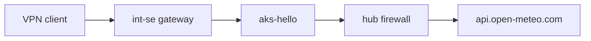

# int-se - Sweden

A placeholder, generated shape only: the documentation agent's first run replaces it. Back to the
[lab examples](index.md).

## aks-hello in int-se-example

```mermaid
flowchart LR
  client["VPN client"] --> gw["int-se gateway"]
  gw --> app["aks-hello"]
  app --> fw["hub firewall"]
  fw --> api["api.open-meteo.com"]
```
